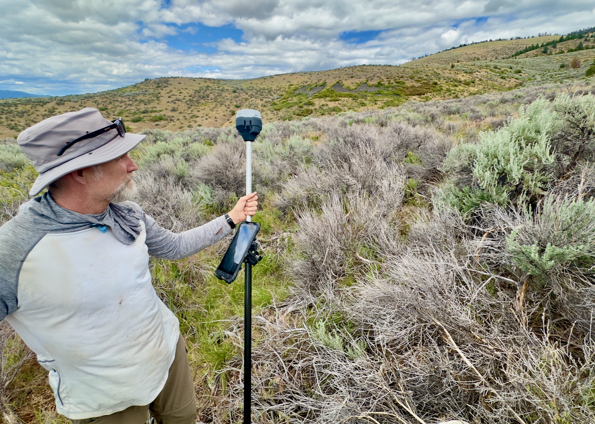

# Sage Thinning Planner

<figure>
  
  <figcaption>
    Dean views a scene of heavy sage mortality due to "volepocalypse".
  </figcaption>
</figure>

Pixels in the sage mortality overlay represent the presence of nearly all sage plants on MPG Ranch. 
Users can view sage presence, the percentage of vole-killed sage within each 10 × 10 m pixel, 
herbaceous layer composition at survey transects, and locations of past sage thinning efforts. 
Together, these data help users consider potential vegetation responses associated with thinning, 
given the composition of nearby vegetation.

## History and Purpose
During the winter of 2024–25, vole populations increased dramatically and consumed sage cambium 
across large areas of MPG Ranch. Many sage plants were girdled and killed. In 2025, we measured 
shrub and herbaceous vegetation to quantify sage mortality and track herbaceous community responses.

We expect sage regeneration to be slow in areas without additional disturbance, with a corresponding 
increase in herbaceous vegetation. Locally abundant and competitive herbaceous species are likely to 
have an advantage during recolonization.

A similar process may occur in areas where sage is mechanically thinned to promote herbaceous forage. 
Where sage mortality is anticipated—whether due to thinning or vole activity—it may be useful to 
consider the surrounding vegetation during planning. High abundance of exotic annual grasses or 
exotic perennial forbs may suggest selecting alternative sites for thinning, such as those with stronger native herbaceous communities.

## Map Display
The map shows MPG Ranch with several user-controlled overlays.  

1. **Sage Mortality heatmap overlay.** This surface was created by Kyle Doherty using drone imagery 
and plant survey data. It shows areas with at least 0.25 m2 of sage within each 10 × 10 m pixel. 
Pixel colors represent the percentage of vole-killed sage, estimated from image analysis, 
ground-based data, and machine learning. Kyle’s latest report is available
<a href="https://docs.google.com/presentation/d/10YaN-7XTyDlqjZ6nJW-tCzRSJrhf6jTejLR_T4m0hEI/edit?usp=sharing" target="_blank" rel="noopener noreferrer">here</a>.
2. **Herbaceous Composition Pie Charts.** Pie charts show the composition of the herbaceous layer, 
grouped by plant functional type (see codes below). These data come from two sources: periodic 
vegetation surveys (aka "grid-veg") and a one-time survey conducted in 2025 for the vole outbreak.
Click a pie to view percent cover, composition, and data source for each location. Composition 
represents the proportion of total herbaceous cover contributed by each group and always sums to 100%. 
For example, if total herbaceous cover is 16% and native perennial grasses account for 8%, their composition is 50%.
Thus, composition identifies which functional group dominates the community, regardless of total cover. 
Based on expected post-sage succession, dominant groups are likely to expand following sage loss.
   - **Plant Functional Group Codes**
       - **EAF** — exotic annual forb
       - **EAG** — exotic annual grass
       - **EPF** — exotic perennial forb
       - **EPG** — exotic perennial grass
       - **NAF** — narive annual forb
       - **NAG** — native annual grass
       - **NPF** — native perennial forb
       - **NPG** — native perennial grass
3. **Existing Sage Thins.** Provided by Chuck Casper. Polygons delineate areas that have been hand-thinned, 
machine-thinned, burned, or treated with combinations of these methods.
4. **MPG Ranch Boundary.** From Chuck Casper (2018). 

## Usage
Users can toggle overlays using the checkboxes and adjust the opacity of the sage overlay and the size of pie charts using the sliders below.

## Development
The source code is available on <a href="https://github.com/bglarkin/sage_thinning_planner" target="_blank" rel="noopener noreferrer">Github</a>. 
Please submit issues there or contact Beau @ MPG Ranch with questions. 

